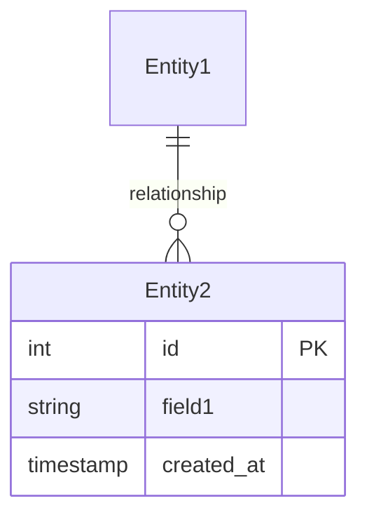
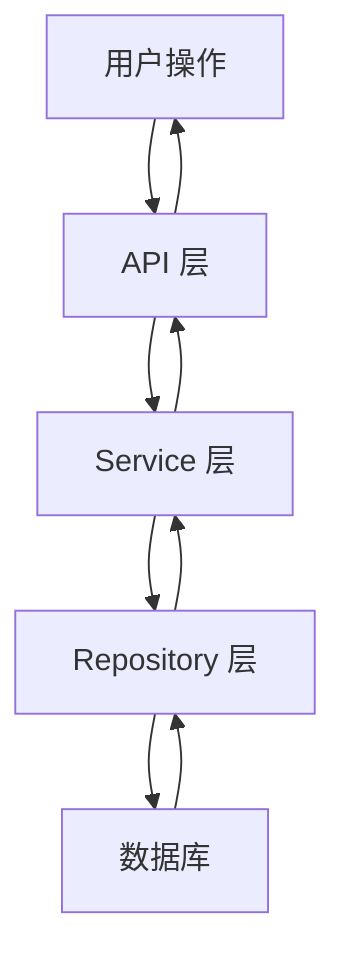

# Design: {功能名称}

---
feature_id: {编号}
feature_name: {功能名}
created_at: {日期}
created_by: /bewater-architect
complexity_tier: standard
implementation_mode: greenfield
---

> **用途**: 技术方案设计，由 Architect Agent 自动生成
> **触发条件**: feature.md 创建后自动生成

## 0. 设计分层（Design Tier）

- `lite`: 只要求变更范围、受影响文件、约束、风险、测试策略、回滚方案
- `standard`: 使用完整设计模板
- `deep`: 在 standard 基础上补充 research / migration / observability

## 0.5 现有实现说明（Existing Implementation Context）

- 当前实现入口:
- 当前已知缺口:
- 当前证据缺口:

---

## 0.6 Story Mapping Layer

### Story Inventory

| story_id | Priority | Story title | Source scenarios | Delivery note |
|----------|----------|-------------|------------------|---------------|
| US-001 | P1 | [故事标题] | S-001, S-002 | [MVP / follow-up / out of scope] |

### Scenario Coverage

| scenario_id | story_id | Given / When / Then summary | Acceptance reference | Design coverage |
|-------------|----------|-----------------------------|----------------------|-----------------|
| S-001 | US-001 | Given [state], When [action], Then [result] | AC-001 | [covered by component/API/data flow] |

### Per-Story Technical Approach

#### US-001 - [故事标题]

- **Architecture implications**: [组件、模块、接口影响]
- **State/data flow**: [状态和数据如何流动]
- **Interfaces**: [API、UI、CLI、事件或集成点]
- **Edge cases**: [边界条件和失败模式]
- **Test focus**: [必须覆盖的 unit/integration/e2e 层级]

### Shared Cross-Story Concerns

- [跨故事复用模块、共享状态、权限、安全、性能或迁移关注点]

### Entry Points & Discovery Path

> `experience_surface=user_visible|mixed` 时必填，说明普通用户如何发现并进入该能力。

| scenario_id | Primary entry point | Secondary entry point | Discoverability expectation | Minimal usage path |
|-------------|---------------------|-----------------------|-----------------------------|--------------------|
| S-001 | [nav/button/help/API docs] | [fallback path or N/A] | [visible to target user] | [steps from entry to success] |

### E2E Test Strategy

> E2E 测试代码是 Build 阶段产物；Validate 只运行和审计已提交的 E2E 套件。
> `static_verify` 不能替代用户可见场景的黑盒验证；`agent-browser is supplemental`，只作为 `exploratory_browser` 证据。

| scenario_id | E2E required | Driver | Test asset path | Data/auth setup | Artifacts |
|-------------|--------------|--------|-----------------|-----------------|-----------|
| S-001 | blackbox_smoke / formal_e2e / static_verify — reason / N/A — reason | Playwright / curl / API / CLI / N/A with reason | `e2e/flows/example.spec.ts` or `tests/blackbox/example.sh` | seed/auth/storage state or N/A with reason | trace / screenshot / video / logs / command log |

- **static_verify**: build, typecheck, lint, grep, source inspection, and file counts. This never proves rendered user behavior by itself.
- **blackbox_smoke**: minimal request through a user-facing boundary, such as `curl` against rendered HTML, API black-box request, or CLI workflow.
- **formal_e2e**: durable automated E2E asset, Playwright by default for Web/UI.
- **exploratory_browser**: optional `agent-browser` exploration, screenshots, and adversarial checks during Validate.
- **Default Web driver**: Playwright for `formal_e2e`; `curl` is allowed for simple public SSR/static `blackbox_smoke`.
- **Non-Web driver**: API contract / CLI flow / service black-box / N/A with reason
- **Mock policy**: real backend / seeded DB / network mock, with reason
- **Artifact policy**: trace, screenshot, video, logs, command output, or equivalent evidence

### AI Behavior Evaluation Strategy

> Required when `feature.md#ai_behavior_eval.required=true`. Build 阶段产出 AI eval asset；Validate only runs and audits AI eval assets.

| scenario_id | eval type | dataset path | scorer or rubric | eval command | threshold | result artifact | Notes |
|-------------|-----------|--------------|------------------|--------------|-----------|-----------------|-------|
| S-001 | exact_match / contains / semantic_similarity / llm_as_judge / tool_outcome / trajectory / human | `evals/{feature-id}/golden.jsonl` | `evals/{feature-id}/rubric.md` or deterministic scorer | `npm run eval:{feature-id}` | `overall >= 0.80 and safety = pass` | `eval-results/{feature-id}.json` | N/A — no AI behavior eval required by default |

Eval level guidance:

- `none`: no AI behavior is shipped.
- `lite`: low-risk AI behavior with a small golden set or deterministic scorer.
- `standard`: user-visible AI behavior with golden and adversarial cases.
- `deep`: agentic, tool-using, safety-sensitive, or irreversible AI behavior with trajectory evidence.

When AI behavior eval is not applicable, write `N/A — no AI/LLM/model/agent behavior is shipped by this feature` in the Notes column.

## Constitution Notes

- checked_against: `docs/00-project/constitution.md`
- relevant_principles: Visual quality, TDD discipline, or N/A - no direct impact
- conflicts: none
- required_follow_up: none

---

## 1. 技术方案概述

[简要描述技术方案的核心思路]

---

## 2. 架构决策（Architecture Decisions）

> **格式**：每个决策说明选择理由和替代方案

### Decision 1: [决策名称]

**选择**: [技术选型]

**理由**:
- [理由 1]
- [理由 2]

**替代方案及拒绝原因**:
- [替代方案] - 拒绝原因：[说明]

**影响**: [此决策对系统的影响]

---

### Decision 2: [决策名称]

...

---

## 3. API 设计

### 端点列表

| 方法 | 路径 | 描述 | 请求体 | 响应 |
|------|------|------|--------|------|
| POST | /api/xxx | 描述 | {...} | {...} |
| GET | /api/xxx/:id | 描述 | - | {...} |

### 命名约定
- 遵循 `architecture.md` 全局约定
- 数据库字段: `snake_case`
- API 请求/响应: `snake_case`
- 前端代码: `camelCase`（前端层做映射）

---

## 4. 数据模型

### 实体关系

### Schema 定义

**Entity1**:
- `id`: 主键
- `field1`: 字段描述
- `created_at`: 创建时间

**Entity2**:
- `id`: 主键
- `entity1_id`: 外键
- `field2`: 字段描述

---

## 5. 数据流

---

## 6. 风险与缓解

| 风险 | 影响 | 缓解措施 |
|------|------|---------|
| [风险描述] | [影响] | [缓解措施] |

---

## 7. 非功能需求

### 性能
- [性能要求]

### 安全
- [安全要求]

### 可扩展性
- [可扩展性要求]
