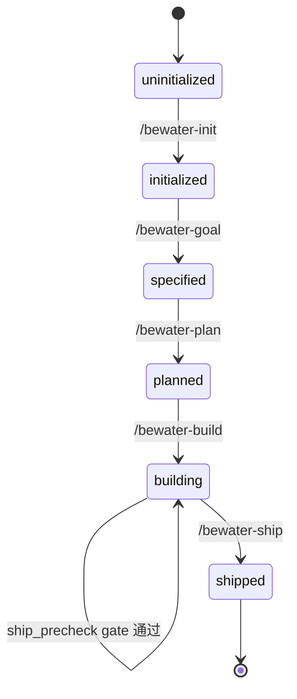

# 环境检查清单

> **版本**: 1.0.0
> **目的**: 定义项目初始化和各阶段执行前的环境检查项
> **适用范围**: /bewater-init、各 Skill 的前置检查

---

## 项目初始化环境检查

### Python 后端项目

- [ ] Python 版本符合要求（≥ 3.9）
- [ ] pytest 已安装并配置
- [ ] pytest.ini 或 pyproject.toml 存在
- [ ] 测试目录结构存在（tests/）
- [ ] PYTHONPATH 配置正确
- [ ] .env.example 文件存在
- [ ] 数据库测试配置存在

### Node.js 前端项目

- [ ] Node.js 版本符合要求（≥ 16）
- [ ] Jest 已安装并配置
- [ ] jest.config.js 存在
- [ ] React Testing Library 已安装（如适用）
- [ ] 测试目录结构存在（__tests__/ 或 *.test.ts）
- [ ] .env.example 文件存在

### 通用检查

- [ ] Git 仓库已初始化
- [ ] .gitignore 文件存在
- [ ] README.md 文件存在

---

## 各 Skill 前置状态检查

### /bewater-init

**前置状态**: 无（首次使用）

**环境检查**:
- [ ] 当前目录可写
- [ ] 父目录存在

---

### /bewater-goal

**前置状态**: `initialized`

**检查逻辑**:
```markdown
## 前置状态检查

执行前检查 state.json：
- 当前状态必须是 `initialized` 或更高
- 如果状态不匹配，提示用户：
  ```
  当前状态：[actual]
  期望状态：initialized
  请先运行 /bewater-init 完成项目初始化。
  ```
```

**文档检查**:
- [ ] docs/00-project/vision.md 存在
- [ ] docs/00-project/architecture.md 存在
- [ ] docs/00-project/constitution.md 存在

---

### /bewater-plan

**前置状态**: `specified`

**检查逻辑**:
```markdown
## 前置状态检查

执行前检查 state.json：
- 当前状态必须是 `specified` 或更高
- 如果状态不匹配，提示用户：
  ```
  当前状态：[actual]
  期望状态：specified
  请先运行 /bewater-goal 定义功能目标。
  ```
```

**文档检查**:
- [ ] docs/01-features/{编号}-{功能名}/feature.md 存在

---

### /bewater-build

**前置状态**: `planned`

**检查逻辑**:
```markdown
## 前置状态检查

执行前检查 state.json：
- 当前状态必须是 `planned` 或 `building`
- 如果状态不匹配，提示用户：
  ```
  当前状态：[actual]
  期望状态：planned
  请先运行 /bewater-plan 生成任务清单。
  ```
```

**文档检查**:
- [ ] docs/01-features/{编号}-{功能名}/feature.md 存在
- [ ] docs/01-features/{编号}-{功能名}/tasks.md 存在

**测试框架检查**:
- [ ] pytest 或 Jest 已配置
- [ ] 测试目录结构存在
- [ ] 如果测试框架未配置，警告用户但允许继续

---

### /bewater-validate

**前置状态**: `building`

**检查逻辑**:
```markdown
## 前置状态检查

执行前检查 state.json：
- 当前状态必须是 `building`
- 内部子阶段应该是 `reviewing` 之后
- 如果状态不匹配，提示用户：
  ```
  当前状态：[actual]
  期望状态：building
  请先运行 /bewater-build 完成代码实现。
  ```
```

**文档检查**:
- [ ] docs/01-features/{编号}-{功能名}/feature.md 存在
- [ ] docs/01-features/{编号}-{功能名}/tasks.md 存在
- [ ] tasks.md 中所有任务标记为完成

---

### /bewater-ship

**前置状态**: `building`（内部子阶段 `ship_precheck gate`）

**检查逻辑**:
```markdown
## 前置状态检查

执行前检查 state.json：
- 当前状态必须是 `building`
- 内部子阶段应该是 `ship_precheck gate`
- 如果状态不匹配，提示用户：
  ```
  当前状态：[actual]
  内部阶段：[internal_stage]
  期望内部阶段：ship_precheck gate
  请运行 /bewater-ship 补齐并核验证据。
  ```
```

**文档检查**:
- [ ] docs/01-features/{编号}-{功能名}/validation-report.md 存在
- [ ] validation-report.md 中无阻断项

---

## 状态机图



---

## 错误消息模板

### 状态不匹配

```markdown
## 状态检查失败

当前状态：`{actual_state}`
期望状态：`{expected_state}`

请按正确的工作流顺序执行：
{missing_steps}

当前公开工作流：init → goal → plan → build → validate → ship
```

### 文档缺失

```markdown
## 文档检查失败

缺少必需文档：`{missing_doc}`

请先运行：`{missing_command}`

## vNext Public/Internal Paths

Default public path: `goal -> plan -> build -> validate -> ship`
Public validation path: `goal -> plan -> build -> validate -> ship`
Shared freshness checker: `.claude/scripts/check-gate-freshness.py`

## Release Adapter Environment

Release adapter configuration lives in `.bewater/release.json`.

- Default `local`: writes release record and local commit; no push or deploy.
- `git_push`: pushes to the configured Git remote after irreversible acknowledgement.
- `script`: runs the configured deploy/publish script after irreversible acknowledgement.

Remote effect adapters are opt-in. `git_push` and `script` must be configured, previewed, and acknowledged before execution. CI wrappers may provide trusted release intent through `runtime.release_intent`.
```

### 测试框架未配置

```markdown
## 测试框架警告

检测到测试框架未完全配置：
{missing_tests}

建议：配置测试框架后再继续。
是否继续？[y/N]
```

---

## 版本历史

| 版本 | 日期 | 变更 |
|------|------|------|
| 1.0.0 | 2026-04-01 | 初始版本 |
