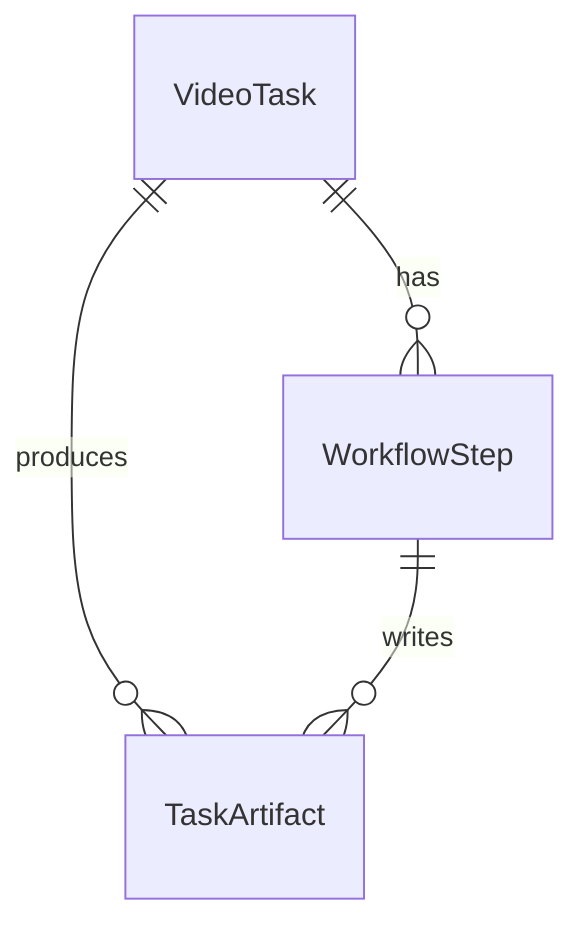
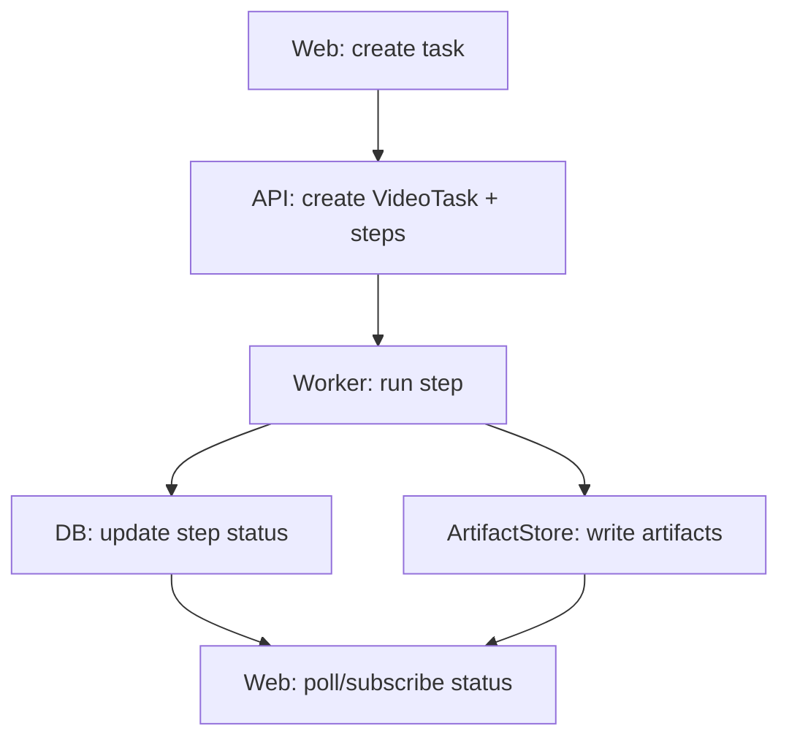

# Design: 知识分享视频任务骨架（任务 / 步骤 / 产物）

---
feature_id: "001"
feature_name: 知识分享视频任务骨架（任务 / 步骤 / 产物）
created_at: 2026-05-05
created_by: /bewater-architect
complexity_tier: standard
implementation_mode: greenfield
---

> **用途**: 技术方案设计，由 Architect Agent 自动生成  
> **触发条件**: feature.md 创建后自动生成

## 0. 设计分层（Design Tier）

- `standard`: 使用完整设计模板（本 feature 涉及 API、任务状态、artifact、重试与 Web 可发现路径）

## 0.5 现有实现说明（Existing Implementation Context）

- 当前实现入口: N/A — greenfield feature
- 当前已知缺口: 全部待实现
- 当前证据缺口: 全部待建立（需要在 Build/Validate 形成任务创建与步骤/产物的边界证据）

---

## 0.6 Story Mapping Layer

### Story Inventory

| story_id | Priority | Story title | Source scenarios | Delivery note |
|----------|----------|-------------|------------------|---------------|
| US-001 | P1 | 任务创建、产物可审阅、可重试 | S-001, S-002 | MVP |

### Scenario Coverage

| scenario_id | story_id | Given / When / Then summary | Acceptance reference | Design coverage |
|-------------|----------|-----------------------------|----------------------|-----------------|
| S-001 | US-001 | Given 输入与素材链接, When 提交任务, Then 任务可追踪且产出可审阅产物 | AC-001 | Web + API + Worker + ArtifactStore |
| S-002 | US-001 | Given 步骤失败, When retry 单步, Then 保留历史产物并重跑 | AC-002 | StepRunner + RetryPolicy + Artifact retention |

### Per-Story Technical Approach

#### US-001 - 任务创建、产物可审阅、可重试

- **Architecture implications**: 引入 `VideoTask` / `WorkflowStep` / `TaskArtifact` 三类核心对象；Web 工作台需要任务列表/详情；Worker 需要按 step_key 执行并写入 artifact。
- **State/data flow**: Web 提交 → API 创建任务与初始化 steps → Worker 执行 step → 写入 artifact 与状态 → Web 查询或订阅更新。
- **Interfaces**:
  - Web: 创建任务、查看任务详情（步骤状态、产物列表、Reviewer findings）
  - API: create / status / artifacts / retry / download（后续扩展）
  - Worker: step 执行入口（按 `step_key` 分发）
- **Edge cases**:
  - source link 不可下载/不可解析：必须记录为不可重试或需要用户动作，并提供“上传素材”降级路径
  - LLM 输出不符合 schema：记录 llm_raw，解析失败写入错误分类，允许重试（可能带不同 prompt/参数）
  - retry 并发：同一步骤应有幂等/互斥策略（同一 task_id + step_key 同时只能运行一个实例）
- **Test focus**:
  - 单元：Step 状态机、artifact 写入、retry policy
  - 集成：API create→worker step→status/artifacts 查询闭环
  - 黑盒：最小 Web 使用路径或 API smoke（满足 discoverability + usage path）

### Shared Cross-Story Concerns

- Artifact-First：每一步必须写出产物或明确跳过原因；失败必须保留错误上下文与已生成产物。
- Reviewability：Reviewer findings 必须定位到 `stage + location_ref`（storyboard segment index 或时间窗）。
- Rights boundary：第一版不做版权判断；必须在 UI/文档提示“用户对输入素材负责”，并在后续切片处理。

### Entry Points & Discovery Path

| scenario_id | Primary entry point | Secondary entry point | Discoverability expectation | Minimal usage path |
|-------------|---------------------|-----------------------|-----------------------------|--------------------|
| S-001 | Web 工作台：创建任务按钮 | 任务列表页的“新建任务” | 内容团队成员登录后可见 | 创建任务 → 查看任务详情 → 查看产物与 Reviewer findings |
| S-002 | 任务详情页：失败步骤的 retry | API：`POST /api/video-tasks/:id/retry` | 失败可见且可操作 | 查看失败原因 → retry → 观察状态变化与产物更新 |

### E2E Test Strategy

| scenario_id | E2E required | Driver | Test asset path | Data/auth setup | Artifacts |
|-------------|--------------|--------|-----------------|-----------------|-----------|
| S-001 | blackbox_smoke | API (`curl`) | `app/tests/blackbox/video_task_smoke.sh`（建议） | N/A — first slice can run without auth | command log + JSON output |
| S-002 | blackbox_smoke | API (`curl`) | `app/tests/blackbox/video_task_retry_smoke.sh`（建议） | N/A — first slice can run without auth | command log + JSON output |

说明：
- 首版以 `blackbox_smoke` 为目标即可；正式 `formal_e2e`（Playwright）可在后续 UI 稳定后补齐。
- `static_verify`（lint/typecheck）不能替代用户可见场景的边界证据。

### AI Behavior Evaluation Strategy

| scenario_id | eval type | dataset path | scorer or rubric | eval command | threshold | result artifact | Notes |
|-------------|-----------|--------------|------------------|--------------|-----------|-----------------|-------|
| S-001 | tool_outcome + schema_check | `app/evals/001/golden.jsonl` | `app/evals/001/rubric.md` | `python -m app.evals.run_001` | schema_pass=1.0 且 reviewer_findings 有效率 ≥ 0.8 | `app/eval-results/001.json` | lite：先保证结构与最小可用性，不追求“爆款质量” |
| S-002 | tool_outcome | `app/evals/001/golden.jsonl` | deterministic | `python -m app.evals.run_001 --retry` | retry_success_rate ≥ 0.95 | `app/eval-results/001.json` | 重点验证失败留痕与重试可用 |

---

## Constitution Notes

- checked_against: `docs/00-project/constitution.md`
- relevant_principles:
  - Evidence-First Delivery
  - User-Visible Slice First
  - Simplicity Over Speculation
  - Reviewable Automation
  - Artifact-First Media Pipeline
- conflicts: none
- required_follow_up:
  - 在首个 build 切片中补齐“素材上传降级路径”的最小 UI 文案提示与错误分类（不需要实现完整下载器）。

---

## 1. 技术方案概述

实现一个面向知识分享工作流的“任务式生产骨架”：
- API 创建 `VideoTask`，初始化一组 `WorkflowStep`（例如：script_generation、review_script、artifact_index）。
- Worker 按 step 执行，写入 `TaskArtifact`（input、llm_raw、parsed_json、review findings 等）。
- Web 展示任务与步骤状态，能查看产物列表与 Reviewer findings，并对失败步骤执行 retry。

本切片不追求完整媒体生产，但要把“可追踪、可审阅、可重试”的工程约束变成硬边界。

---

## 2. 架构决策（Architecture Decisions）

### Decision 1: 线性 StepRunner + Skill Contract，而不是通用编排引擎

**选择**: 线性 `StepRunner(step_key)` + `Skill` 接口（每个 step 输出 artifact）

**理由**:
- 第一版只需要稳定骨架与审阅闭环，通用编排会放大复杂度。
- Skill contract 让后续口播/产品介绍复用能力，而不复制流程。

**替代方案及拒绝原因**:
- 通用 DAG/节点图引擎 — 拒绝原因：首版过重，调试成本高，且与“简约优于猜测”冲突。

**影响**: Step 扩展通过新增 step_key + contract 完成；不阻塞后续抽象，但首版不引入。

### Decision 2: ArtifactStore 为一等对象（失败留痕 + 可审阅）

**选择**: 每个任务有 artifact_dir（或等价存储索引），每步必须写 artifact

**理由**:
- Reviewer 与重试依赖可定位的中间产物。
- 视频系统不保存中间产物会导致后续素材匹配阶段不可控返工。

**替代方案及拒绝原因**:
- 只保存最终结果 — 拒绝原因：无法满足 Reviewable Automation 与 Artifact-First 原则。

**影响**: 需要定义 artifact_type、metadata 与保留策略；为后续 validate 证据提供基础。

---

## 3. API 设计

### 端点列表（第一版建议）

| 方法 | 路径 | 描述 | 请求体 | 响应 |
|------|------|------|--------|------|
| POST | /api/video-tasks | 创建任务 | `{input_kind,input_text,source_links}` | `{task_id}` |
| GET | /api/video-tasks/:id | 查询任务 | - | `{task,steps}` |
| GET | /api/video-tasks/:id/artifacts | 查询产物列表 | - | `{artifacts[]}` |
| POST | /api/video-tasks/:id/retry | retry 某步骤 | `{step_key}` | `{accepted}` |

---

## 4. 数据模型

### 实体关系（概念）

---

## 5. 数据流

---

## 6. 风险与缓解

| 风险 | 影响 | 缓解措施 |
|------|------|---------|
| source link 不可下载 | 后续素材链路阻断 | 设计上强制支持上传素材降级，并把失败分类为“需要用户动作” |
| LLM 输出不稳定 | 产物不可消费 | 保留 llm_raw；解析失败可重试；增加 schema 校验与最小 golden eval |
| retry 并发与幂等 | 状态错乱 | 同 task+step 的互斥执行；写入 attempt 记录；保留历史产物 |

---

## 7. 非功能需求

### 性能

- API 创建任务必须快速返回（异步执行 step）。
- 列表/详情查询不应读取大型媒体文件；产物以索引/metadata 返回。

### 安全

- 所有用户输入按不可信处理；输出渲染防 XSS。
- 素材权利边界提示：系统不承诺版权判断，用户负责输入素材使用权。

### 可扩展性

- 新视频类型以 workflow 配置 + 复用 Skills 扩展。
- Skill 输出 contract 稳定，允许替换供应商（LLM/TTS/下载器）。
